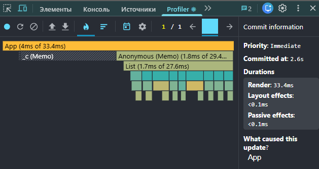
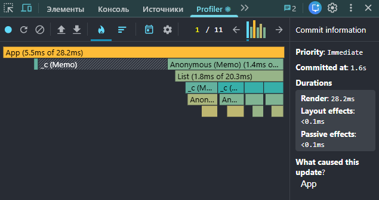
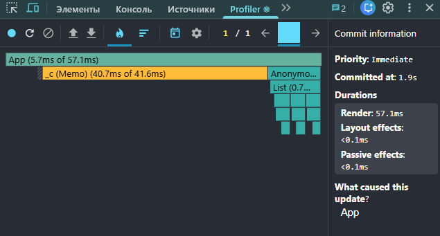
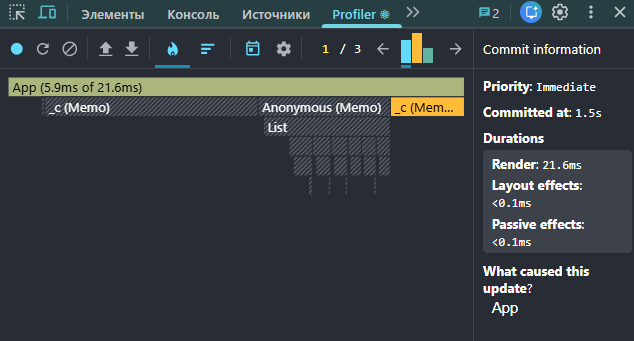

# Performance Optimization Report

## Baseline Measurements

### Interaction A: Sort countries

- **Commit duration**: 3.1 s
- **Render duration**: 495.6 ms
- **Screenshot**: 

### Interaction B: Search countries

- **Commit duration**: 2.2 s
- **Render duration**: 230.6 ms
- **Screenshot**: 

### Interaction C: Change year

- **Commit duration**: 3.4 s
- **Render duration**: 526.1 ms
- **Screenshot**: 

### Interaction D: Toggle column

- **Commit duration**: 2.1 s
- **Render duration**: 325.1 ms
- **Screenshot**: 

## Optimized Measurements

### Interaction A: Sort countries

- **Commit duration**: 2.6 s
- **Render duration**: 33.4 ms
- **Screenshot**: 

### Interaction B: Search countries

- **Commit duration**: 1.6 s
- **Render duration**: 28.2 ms
- **Screenshot**: 

### Interaction C: Change year

- **Commit duration**: 1.9 s
- **Render duration**: 57.1 ms
- **Screenshot**: 

### Interaction D: Toggle column

- **Commit duration**: 1.5 s
- **Render duration**: 21.6 ms
- **Screenshot**: 

## Summary of Improvements

| Interaction      | Baseline (ms) | Optimized (ms) | Improvement |
| ---------------- | ------------- | -------------- | ----------- |
| Sort countries   | 495.6         | 33.4           | 93%         |
| Search countries | 230.6         | 28.2           | 88%         |
| Change year      | 526.1         | 57.1           | 89%         |
| Toggle column    | 325.1         | 21.6           | 93%         |
| **Average**      | 394.4         | 35.1           | 91%         |
