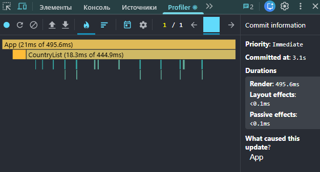
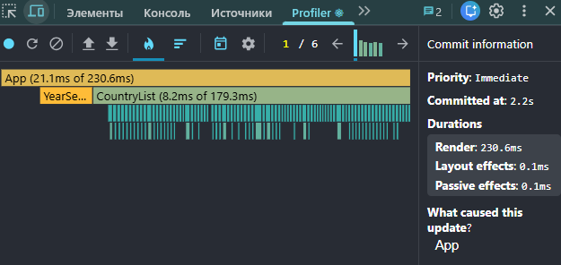
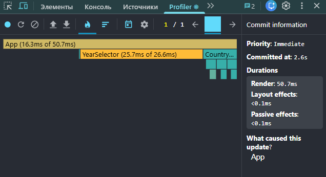
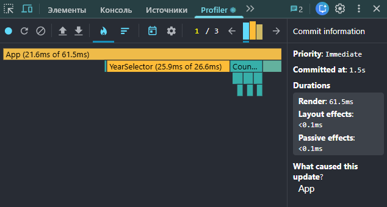

# Performance Optimization Report

## Baseline Measurements

### Interaction A: Sort countries

- **Commit duration**: 3.1 s
- **Render duration**: 495.6 ms
- **Screenshot**: 

### Interaction B: Search countries

- **Commit duration**: 2.2 s
- **Render duration**: 230.6 ms
- **Screenshot**: 

### Interaction C: Change year

- **Commit duration**: 2.6 s
- **Render duration**: 50.7 ms
- **Screenshot**: 

### Interaction D: Toggle column

- **Commit duration**: 1.5 s
- **Render duration**: 61.5 ms
- **Screenshot**: 